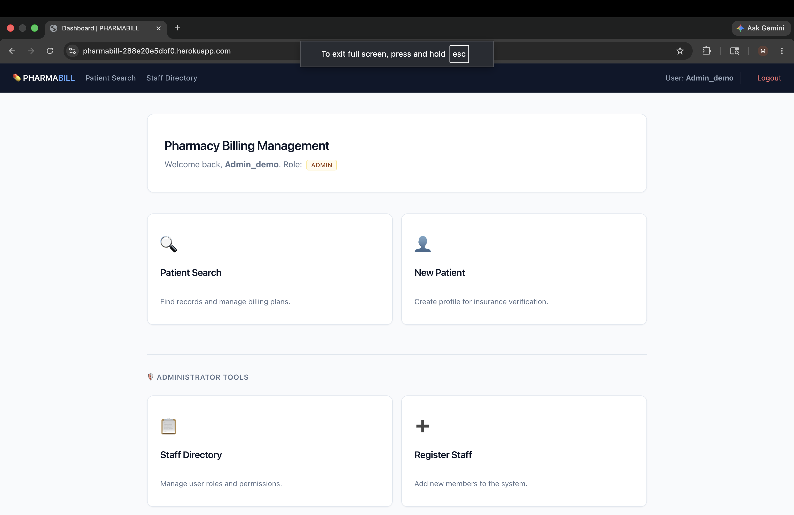
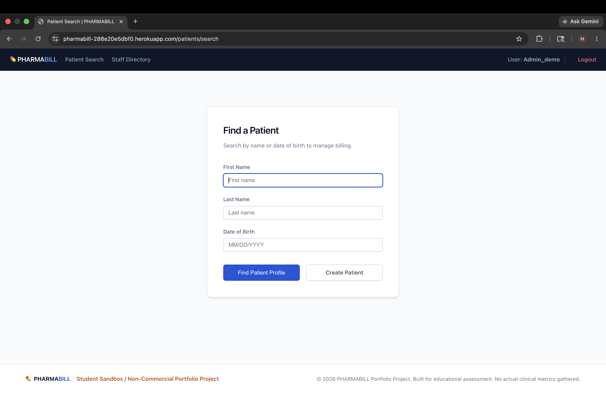
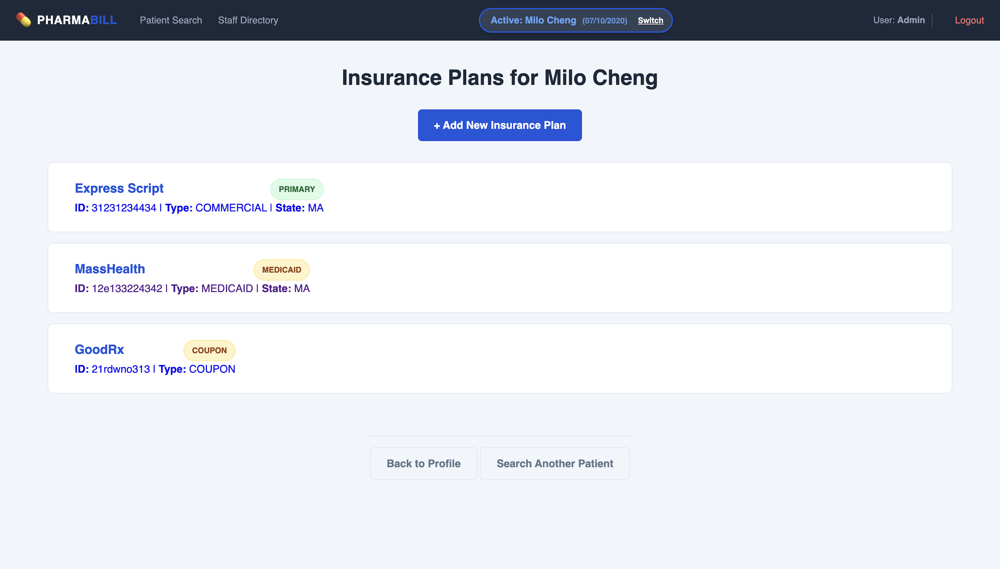
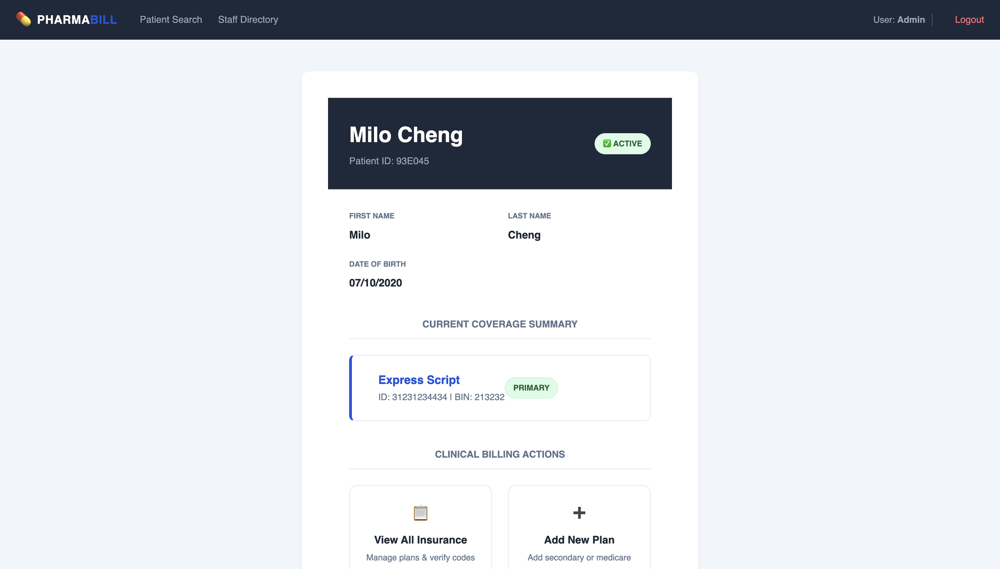
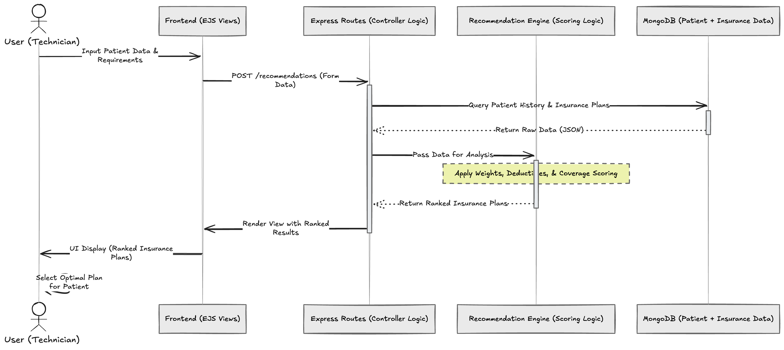

# 💊 PHARMABILL


PHARMABILL is a full-stack pharmacy workflow application that automates the Coordination of Benefits (COB) process by intelligently ranking patient insurance plans.

> 💊 **Real-World Origin**
> Built from firsthand experience working at **CVS Pharmacy** — where insurance billing errors, trial-and-error claim submissions, and staff inefficiencies are daily realities.

> "Taking the guesswork out of pharmacy billing."

**[View PHARMABILL on Heroku](https://pharmabill-288e20e5dbf0.herokuapp.com/)**

## ⚡ Quick Start

```bash
git clone https://github.com/chengmichelley/pharmabill.git
cd pharmabill
npm install
```

> ⚙️ **Before continuing:** Create a `.env` file in the root directory. See `.env.example` for required variables (MongoDB URI, session secret).

```bash
node seed.js
npm start
```
---

## 🧠 The Problem

In retail pharmacy environments, the drop-off station is a critical bottleneck. Pharmacy staff must quickly enter prescription data, identify the correct insurance plan, and process claims — often with limited or inconsistent information from the patient.

**Key Challenges**

- Multiple insurance plans may share the same BIN but differ in PCN or group number
- Insurance selection often relies on trial-and-error
- Incorrect billing leads to:
  - Claim rejections
  - Triage rework
  - Increased patient wait times

This creates operational inefficiencies and added pressure on pharmacy staff.

---

## 💡 The Solution

PHARMABILL introduces a rule-based recommendation engine that ranks insurance plans based on real-world billing logic.

Instead of guessing, staff receive:

- Clear Primary / Secondary / Tertiary recommendations
- Intelligent prioritization based on patient and plan data
- The ability to manually override decisions when needed

---

## ⚙️ Billing Recommendation Logic Engine

PHARMABILL implements a custom weighted prioritization algorithm to automatically determine the correct billing hierarchy for patients with multiple concurrent insurance policies. This prevents Coordination of Benefits (COB) network rejection faults at the point of claim submission.

The prioritization process runs in three distinct sequential stages:

### 🧮 1. Weight Calculation Formula
The logic engine evaluates each active policy through three parameter checks to calculate a final penalty `score`:

$$\text{Final Score} = \text{Coverage Type Base Weight} - \text{Relationship Discount} - \text{Manual Boost Value}$$

#### A. Coverage Type Base Weights
Plans are assigned static baseline penalties. Lower values indicate higher billing priority:
* **Commercial** (Private / Employer): `10` points
* **Medicare** (Federal Elderly Care): `20` points
* **Medicaid** (State Assistance): `30` points
* **Discount Coupon / GoodRx**: `40` points
* *Fallback Catch-All*: `50` points

#### B. Subscriber Relationship Deductions
Per standard COB coordination rules, a policy held directly by the patient outranks one where they are covered as a dependent.
* If `relationship === 'self'`, the engine applies a **`-5` point discount** to lower the penalty score.

#### C. Manual Priority Boosts
Staff can override automated weights at any time using the optional `priority` field.
* The user-defined integer (`0`–`100`) is **subtracted directly** from the final penalty score.

---

### 🧬 2. Sorting & Example

Plans are sorted from **lowest** penalty score to **highest**:

```javascript
// Lower score = higher billing priority
ranked.sort((a, b) => a.score - b.score);
```

#### 📌 Scenario Example
A patient presents three active policies:
1. **Plan A**: Medicare — primary subscriber (`relationship: 'self'`)
2. **Plan B**: Commercial — covered as dependent through spouse (`relationship: 'dependent'`)
3. **Plan C**: Manufacturer Discount Coupon — primary subscriber (`relationship: 'self'`)

**Score breakdown:**
* **Plan B (Commercial)**: Base `10` - Subscriber `0` = **Score: `10`**
* **Plan A (Medicare)**: Base `20` - Subscriber `5` = **Score: `15`**
* **Plan C (Coupon)**: Base `40` - Subscriber `5` = **Score: `35`**

**Resulting priority order:**
1. **Plan B (Commercial)** — *Score: 10* → Recommended Primary
2. **Plan A (Medicare)** — *Score: 15* → Recommended Secondary
3. **Plan C (Coupon)** — *Score: 35* → Coupon Placement

> 💡 **Developer Note on COB Priority Hierarchies:**
> While subscriber policies generally outrank dependent policies within the same insurance category, standard COB guidelines require that private Commercial employer insurance be billed before public government programs like Medicare.
>
> Because the algorithm weights `coverageType` (a delta of 10 points) more heavily than the `relationship` modifier (a delta of 5 points), the system correctly prioritizes the dependent Commercial plan over the primary Medicare plan — matching real-world compliance standards.

---

### 🏷️ 3. Semantic Label Wrapping
Once sorted, the array maps user-friendly labels to dashboard cards so staff immediately understands the filing order:
* **Discount Coupons** display as **`Coupon`**.
* **Medicaid Plans** display as **`Medicaid`** (acting as the universal payer of last resort under federal guidelines).
* All remaining plans are assigned sequential tags via an auto-incrementing index: **`Primary`**, **`Secondary`**, **`Tertiary`**.

---

## 📸 Screenshots

| Dashboard View | Patient Search |
| :--- | :--- |
|  |  |

| Insurance Ranking | Patient Profile |
| :--- | :--- |
|  |  |

---

## ✨ Core Features

### 🚀 Insurance Recommendation Engine

Ranks plans using weighted factors:
- Relationship Status (Self vs Dependent)
- Coverage Type (Commercial, Medicare, Medicaid, Coupon)
- Manual Priority Boost
- Automatically assigns Primary, Secondary, Tertiary labels

### 👤 Patient-Centric Workflow

- Search or create patient profiles
- Manage multiple insurance plans per patient
- Persistent Active Patient Session across views

### 🛡️ Role-Based Access Control

- Admin: Manage staff accounts and permissions
- Staff: Manage patients and insurance plans

### 📦 Data Integrity Features

- Soft-delete (archiving) for insurance plans
- Structured schema for consistent data entry
- Designed to handle incomplete or ambiguous insurance data

---

## 🔑 Engineering Concepts Demonstrated

- **Weighted ranking algorithm** — Custom scoring system with configurable penalty weights to simulate real-world COB billing logic
- **Session state management** — Persistent active patient context maintained across all views without repeated database lookups
- **Role-based authorization** — Middleware-enforced permission layers separating admin and staff access at the route level
- **Soft-delete archival pattern** — Insurance plans are deactivated rather than destroyed, preserving billing history and enabling reactivation
- **MVC routing structure** — Express routes delegate to controller logic cleanly separated from view rendering
- **MongoDB schema modeling** — Flexible document structure accommodating incomplete insurance data common in real pharmacy workflows
- **Server-side rendering with EJS** — Templated views with dynamic data injection, session-aware UI components, and persistent navbar state

---

## 🏗️ Architecture

### System Flow



### 🔄 Example Workflow

1. Search or create a patient
2. Add multiple insurance plans
3. PHARMABILL ranks plans instantly
4. Select the top recommended plan
5. If claim fails → proceed to the next ranked option

### 🛠️ Tech Stack

**Frontend** — EJS (server-rendered views), HTML5, CSS3

**Backend** — Node.js, Express.js, Method-Override, Dotenv

**Database** — MongoDB, Mongoose ODM, Connect-Mongo

**Authentication** — Session-based auth, Role-based authorization, Bcrypt.js, Express-Session

---

## 💻 Local Setup & Testing

Follow these steps to seed, authenticate, and verify your local environment independently of the production Heroku instance.

### 🔐 Local Demo Credentials
Running the local initialization script populates two pre-configured staff profiles with varying permission layers to allow full testing of the authorization middleware:

| Role | Username | Password | Access Capabilities |
| :--- | :--- | :--- | :--- |
| **Administrator** | `admin_demo` | `password123` | Full CRUD access, role management, staff deletion. |
| **Staff Member** | `staff_demo` | `password123` | Patient lookup, billing management, restricted from admin panels. |

### 🧪 Testing the Local Seed Dataset
After executing `node seed.js` against your local `.env` database connection string, open `http://localhost:3000` and verify system behavior using these test search queries:

* **Direct Profile Redirection**: Search for `John Doe`. The system will automatically skip the listings page and redirect straight to his individual patient hub.
* **Multi-Match Layout Grid**: Search for `Jane Smith` to test how the interface stacks and displays multiple records matching identical criteria.
* **Account Reactivation Feature**: Search for `William Davis` to view an inactive account and test the dynamic **✨ Activate** status toggle.

### How to Use

**1. Find or Create a Patient**
* Use the **Patient Search** card to find a profile by name or date of birth.
* If no profile exists, click **Create New Patient** to start a fresh record.

**2. Manage Insurance Plans**
* From the **Patient Profile**, click **Add New Plan**.
* Enter the four RX identifiers found on the pharmacy benefit card (**BIN, PCN, Group, and Member ID**).
* Select the **Relationship** (Self/Dependent) and **Coverage Type** — these fields drive the automated ranking logic.

**3. View Recommendations**
* Navigate to the **Insurance Plans** list.
* The system automatically applies COB logic and labels plans as **Primary**, **Secondary**, or **Tertiary**.
* Click the **Active Patient** bubble in the navbar at any time to return to the clinical summary.

**4. Admin Management** *(Admin Role Only)*
* Access the **Staff Directory** to register new pharmacy staff and assign roles.
* Manage user accounts as personnel changes occur.

---

## ⚠️ Challenges & Tradeoffs

### Real-World Ambiguity

Patients frequently arrive without complete insurance information — especially when they are covered as a dependent on someone else's plan and don't have access to the physical card. Unlike physician office systems that have access to comprehensive patient records, pharmacy benefit data is not centrally accessible. Staff must work with whatever the patient provides and, when necessary, process a cash transaction and rebill once the full insurance information is obtained.

- **Flexible schema design** — BIN is required, but PCN, Group, and Member ID are optional fields. This reflects real drop-off conditions rather than enforcing strict validation that would block workflows when patients arrive with partial information.
- **Manual override capability** — Automated ranking cannot account for every edge case. Staff can apply a manual priority boost to force a specific plan to the top of the billing queue without altering the underlying weights. This also supports dual-billing scenarios where both a private plan and Medicare or Medicaid must be submitted in sequence.

### Accuracy vs Complexity

A fully accurate COB system would require live integration with a HIPAA-compliant medical clearinghouse API to retrieve and verify real-time payer data.

- **Rule-based approximation** — Rather than attempting live adjudication, PHARMABILL creates a structured local record of the insurance plans a patient presents, then applies real-world COB logic to recommend the optimal billing order without requiring external API calls.
- **Workflow efficiency over adjudication replacement** — The goal is not to replicate what a clearinghouse does, but to eliminate the guesswork that technicians face when multiple plans share the same BIN and PCN. This reduces trial-and-error submissions and shortens triage time.

### State Management

In a busy pharmacy environment, technicians frequently context-switch between patients and workstations. Losing track of which patient is currently being processed is a real operational risk.

- **Session-based active patient tracking** — A persistent session variable stores the currently active patient so their context is available across all views without requiring repeated lookups.
- **Persistent UI indicator** — A visible bubble in the navbar displays the active patient's name and date of birth at all times. Staff can switch patients or clear the session at any point, preventing cross-patient billing errors.

---

## 🔮 Future Roadmap

* **Adjudication Simulator** — Simulate real claim responses (e.g., Prior Authorization Required, Refill Too Soon)
* **Prescription Intake Module** — Support full script entry workflows including medication name, NDC, dosing, and prescriber information (NPI, DEA)
* **Medication API Integration** — Identify generic vs. brand medications at point of entry
* **HIPAA-Compliant Clearinghouse Integration** — Connect to a real payer network to retrieve live insurance benefit data
* **Audit Logging** — Track billing decisions, manual overrides, and claim retry history per patient session

---

## ⭐ Final Note

PHARMABILL was built from firsthand experience watching skilled pharmacy technicians burn time on billing guesswork that a structured system could eliminate. The scope was intentionally focused — a real pharmacy record includes medication details, NDC codes, prescriber NPI and DEA numbers, and much more. Rather than replicate the full clinical record, this project isolates the COB triage decision and builds logic around it: given the insurance plans a patient presents, what is the optimal billing sequence? That focused problem is where the most friction exists day-to-day, and it's what this system is designed to solve.
